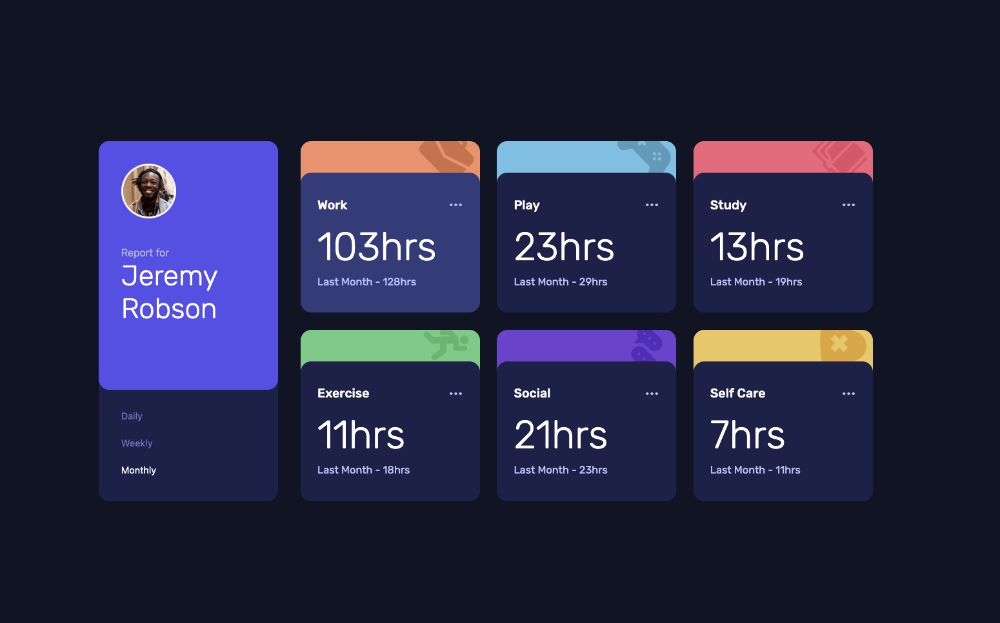

# Frontend Mentor - Time tracking dashboard solution

This is a solution to the [Time tracking dashboard challenge on Frontend Mentor](https://www.frontendmentor.io/challenges/time-tracking-dashboard-UIQ7167Jw). Frontend Mentor challenges help you improve your coding skills by building realistic projects.

## Table of contents

- [Overview](#overview)
  - [The challenge](#the-challenge)
  - [Screenshot](#screenshot)
  - [Links](#links)
- [My process](#my-process)
  - [Built with](#built-with)
  - [What I learned](#what-i-learned)
  - [Useful resources](#useful-resources)
- [Author](#author)

## Overview

### The challenge

Users should be able to:

- View the optimal layout for the site depending on their device's screen size
- See hover states for all interactive elements on the page
- Switch between viewing Daily, Weekly, and Monthly stats

### Screenshot

### Links

- Solution URL: [Solution](https://github.com/vince4dev/challenge11)
- Live Site URL: [Live site](https://vince4dev.github.io/challenge11/)

## My process

### Built with

- Semantic HTML5 markup
- CSS custom properties
- Flexbox
- CSS Grid
- Mobile-first workflow
- Javascript

### What I learned

This challenge allowed me to consolidate my skills in frontend development by designing a dynamic and interactive application. Here are the main technical and methodological achievements:

🔹 1. Using the Fetch API to load JSON data

- I learned how to retrieve external data via fetch() and parse it with .json().
- The use of async/await made the asynchronous code more readable and easy to maintain.
- I understood the importance of processing promises properly and managing loading states before the final rendering.

🔹 2. Exploitation of data-\* attributes in HTML

- I used custom attributes (data-category, data-period) to semantically mark the interactive elements.
- In JavaScript, element.dataset, and selectors like document.querySelectorAll('[data-...]') have simplified the manipulation of the DOM without depending on complex classes or IDs.
- This has strengthened the separation between HTML structure, CSS style and JS logic, while improving maintainability.

🔹 3. Robust error management with try...catch

- I have integrated try...catch blocks to intercept network errors, JSON parsing failures or cases where data is missing.
- I learned to display backup statuses (error message) to preserve the user experience.
- Proactive error management has become an essential reflex for building reliable applications.

🔹 4. Implementation of a modal loading window

- I designed and integrated a loading indicator (overlay/spinner) to improve UX during network queries.
- Visibility is managed dynamically via CSS (opacity, display or transform) and enabled/disabled at startup and end of fetch().

💡 Bonnes pratiques acquises

- ✅ Privilégier async/await plutôt que les .then() enchaînés pour plus de lisibilité
- ✅ Utiliser data-\* pour lier HTML et JS de manière déclarative et maintenable
- ✅ Toujours prévoir un fallback en cas d’échec réseau ou de données invalides
- ✅ Afficher un état de chargement clair pour éviter l’impression de "gel" de l’interface
- ✅ Séparer clairement la logique de récupération des données de la logique d’affichage

### Useful resources

- [google-webfonts-helper](https://gwfh.mranftl.com/fonts) - This helped me find the font and integrate it into the project.
- [MDN](https://developer.mozilla.org/fr/) - Resources for Developers.

## Author

- Frontend Mentor - [@vince4dev](https://www.frontendmentor.io/profile/vince4dev)
